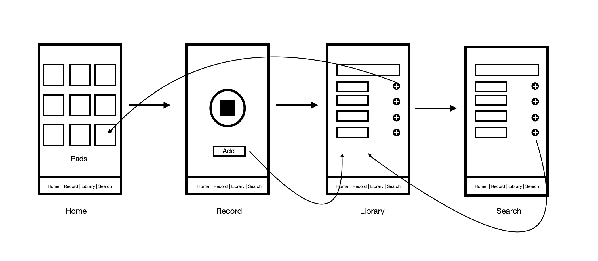

# Soundboard-master

>School project - React Native
> 

The goal of this project is to implement a simplified virtual version of a physical sampler / sequencer. These systems allow live play of a bank of pre-recorded sounds through the use of a grid of pads. In their simplest version, these machines can only be used in their sampler version: the samples can be played by pressing the pads, like a synthesizer, but more advanced versions allow a sequencer type use (the user can create/edit loop played repeatedly in order to create rhythms/patterns).

## Model / Design

- **Playground** : This is the home screen which in the form of pads integrates the different samples added from the library. A simple click, and the playback of the sound will launch. I added on this screen the possibility to empty the redux store via a long press on one of the items.
- **Recording** : The screen to record a sound from the microphone with the possibility to play/stop the recorded sound and save in the library.
- **Library** : We find here all the samples that can be sorted according to their origin (recorded, default and freesound). The OptionButtton component is also integrated into this page in order to be able to delete, modify or even add the item to the soundboard.
- **Search** : This screen allows the search for a sample by keyword using the freesound API with the possibility of adding an item in the library.

## Architecture 

For this project, I decided to use typescript to get started with this language, I didn't exploited it enough but it was still a good discovery.
Concerning the architecture of the application, as often I dissociate screens, components and services (although there is still many optimization to be done).

The **src** directory is structured like this:

- **components** : It contains all the components that can be used several times.
- **core** : It only contains a theme.js file which allows me to reference all the colors of my application.
- **redux** : This directory contains all the Redux slices.
- **screens** : This is where we find the 4 screens of the model.
- **utils** : Some features/services that the application needs.

As expected, I used the Redux store to store the samples. A slice is used to store the samples of the soundboard and the other manages the samples of the library, in both slices the data is stored in an object which has several attributes:
- id
- name
- link
- image
- type
- duration

## Libs

For navigation between views I decided to use the TabBar from **@react-navigation**, simple to set up and efficient.
I used the expo-av library to play with sounds and generate an audio object same than samples.

⚠️ In order to save a vocal recording I used th **expo-file-system** library able to provides access to a file system stored locally on the device. Unfortunately this library is not compatible on the web therefore the functionality of saving a voice recording does not work on the web. I'll take a closer look soon.

## Functionnality 

- Persisted storage ✅
- Playing samples ✅
- Add freesound to library ✅
- Add recording to library ✅
- Add item library to soundboard ✅
- Edit name (more to come...) ✅
- SearchByType samples ✅

- Edit all ❌
- Cropping sample ❌
- Stop current sound ❌

# Setup
1.  `yarn` to install all the dependencies

2.  `yarn start` to run expo

